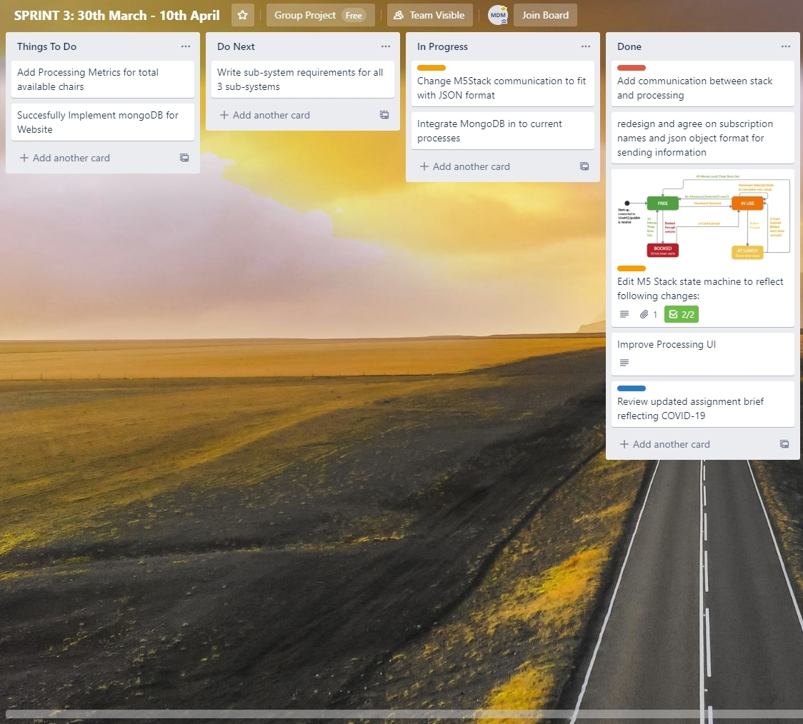

# Project Evaluation

# Project Successes & Limitations
Overall, we feel that the project was a successful proof of concept. Current circumstances regarding COVID-19 notwithstanding, being able to access study spaces in busy times is a key concern for many students, and universities failing to address this demand has the potential to drive down student satisfaction. Even with the basic functionality implemented in our prototype, the potential to assist universities in maximizing efficient use of their pre-existing spaces is clear. We also found that our broad overview of the system architecture did not require any particularly significant re-designs over the course of the project which enabled us to better refine each key sub-system and provide a more complete product. Instead, we decided to strip back proposed features in early stages to better focus development of core systems and features. One such example was the decision to abandon a group booking feature which would allow multiple seats / private rooms to be booked at once by societies, study groups etc.

However, we do also feel that while the design we implemented was suitable for the basic prototype as required by the brief, questions were raised about the suitability of the system architecture for a live product. On the one hand, the Object Oriented design of the desktop app made scaling the app for large institutions trivial, however at the same time the Processing application felt a little like a box ticking exercise and the design would be better suited to also being a web-based application that was closely partnered with the existing web app, accessed via a separate admin login.

This seems to be a simpler and more elegant overall design as it would have stripped back the need to communicate large quantities of data via MQTT. This also would have allowed for more straightforward integration of the MongoDB database. Currently, the database is connected to the web-application despite the fact it would have made more sense to link it with the desktop app, while the desktop app retrieves the data it created and sent from the web-app upon starting up.

The reason for this is that the current version of processing does not support the libraries needed to integrate a java-MongoDB API and it was beyond the scope of the project to import the libraries and handle the various errors and exceptions manually. Even without this issue, having both the end-user and admin-user applications part of the same system would have made database access and data communication across the system much more straightforward. We were also unsure to what extent all parts of our system were Object-Oriented. While certain parts of the desktop app did use OOP, other parts did not and it did not seem necessary for the web application and Stack code for building the prototype.

Finally, questions were raised throughout the project about the viability of the concept in a live environment. The concept should, in theory, solve the issue, and we feel that the simple UI and straightforward nature of the goal of the product encourages use. However, proper usage relies on mutual good faith between users and, where necessary, intervention on behalf of the institution to enforce correct usage of the product.

# Future Work
As a result of this we feel that extensive market research and live testing will be necessary to understand to what degree the current design iteration improves desk space access, and whether students find the product useful. We suggest extensive interviews with university admin and students to gain a more in-depth understanding of their respective needs and drive future development through trying to meet these needs before further demo testing takes place.

Before this, the group is already aware of additional features that should be implemented. On the side of the processing app, this involves a more robust add/remove table feature that not only allows for various-sized tables but also for the administrator to arrange the tables on the screen to visually represent the actual layout of the study space. In addition, implementing a statistical analysis system so the administrator can track commonly used and unused spaces will be an important feature for the live product. Alongside this, extending the MQTT communication between all subsystems such that messages are sent whenever a chair is interacted with (I.e. booked, occupied, free, etc.) will be essential for this to work. Currently, this is conferred between the Stack and the other two subsystems, but this will need to be extended to communications between the web app and desktop app. This was something we wanted to implement when we started the project but ended up being unfeasible when we simplified the data structures that were communicated between subsystems.

To achieve this, we would likely need to use a chair database (as opposed to data stored room-by-room), and contrary to the current structure, all of the different applications would stream into the database as opposed to sending messages on the MQTT broker, and would then communicate with the database to publish and receive changes from the other applications. This would avoid needing to have the web server running in order to receive data from the database. The introduction of an analytics dashboard using a tool like PowerBI or Tableau could allow senior university staff a high-level overview of how study space resources are being utilized in real time with trend data being used to influence resource allocation decisions moving forwards.

While the website has the functionality necessary to demonstrate the product, a few more essential features would be necessary to bring this product to market. There are no user accounts currently; for the purposes of prototype and resources (only having a single stack, lack of time) it didn’t make sense to implement these. Currently the website only functions correctly on a desktop browser and would need to be optimised for mobile usage; we suspect it would mostly be used on mobile by students on their way to university.

Studies will also need to be conducted to determine the correct level of vibration detection for the stack so that the chair stays in the ‘occupied’ state for the entire duration that a person is sitting in it. It will be essential to the product’s success that the chair does not revert back to free while they are sitting still or only leave their seat momentarily (which is partly solved using the cumulative movement values in the ‘occupied’ loop, but the numbers used are only estimates). The vibration detection limits could also vary with stack placement and from stack-to-stack, so this will also need to be investigated and optimised before implementation in a live environment.

Another area of future development would be the addition of the RFID scanner which proved difficult to implement with the aftermarket RFID unit. A card scanner would ensure only the students who had booked a desk would be able to authenticate their booking. It would also allow for admins to scan their card to declare a chair as ‘broken’, or enter the setup state on any device should its IDs need to be reconfigured (when reallocating chairs to different study spaces for example).

# Teamwork and COVID-19
The team worked together very well overall. Despite the team lacking a single clear leader, each member took responsibility for overseeing and managing at least one part of the project, whether that was leading development on a subsystem or documenting design and analysis processes. Prior to lockdown, communication was regular and weekly meetings took place in which members tested each other’s code and critiqued design and implementation. Access to potential users allowed semi-regular user testing and modification where needed. Communication overall was excellent and was entirely driven by face to face meetings in the early stages of the design process. Few issues or arguments needed to be managed; everyone was open to criticism and it was constructive where offered. Each subsystem was always in a working state, which allowed for straightforward demonstration during weekly meetings.

Upon reflection, our modular approach to task delegation was perhaps too rigid and made the subsystem integration process more difficult than it needed to be. The team was split into three groups of two each of whom worked on their respective subsystem for the duration of the project. This could have been a major issue if we did not have as clear a goal in mind or our communication was weaker. Prior to the lockdown, perhaps it may have been more optimal to rotate which members worked on which subsystem so that the general design strategies could have been better integrated.

That being said, there were advantages to this modular approach. Breaking down the project into these subsystems made the task easier to tackle and having the same individuals continuing to work on and improve the subsystem saved time by avoiding having to bring other team members up to speed. We also made good use of pair programming, and it proved instrumental when problem-solving buggy code. At the same time, this approach could have been refined. As the complexity of the programme increased, issues arose amongst the desktop team (particularly after lockdown) where the paired programmer would lose track of what the main programmer was doing, making paired bug fixing more difficult than necessary. In the future, relaxing this modularity and giving each team member more regular access and input into the design of each respective subsystem would be beneficial.  

We used Trello as a makeshift Kanban board, updating and checking off to-do lists on a sprint by sprint basis as well as checking off non-coding related requirements. This was also used as a makeshift sharing board for charts and basic prototypes. We opted to use Trello for its depth of functionality and it ended up being as much a hub for our group work as the GitHub repository was.

  

  <i>Trello kanban board from sprint 3, showing how the different topics on the kanban board were used</i>

WhatsApp ended up being an invaluable tool both for meeting organisation as well as regular team contact as we transitioned to online learning and did not have opportunities to organise meetings while at university. Any issues that arose that were not mentioned during arranged meetings were often discussed and solved here. The WhatsApp group also doubled up as a general discussion forum for non-SEGP related topics. Using it in this capacity helped improve morale and indirectly made SEGP discussions more frequent.

Naturally the closure of the university and subsequent lockdown made face to face meetings impossible and made integration of subsystems more difficult. Previously each sub-team had been doing pair programming with one person writing the code whilst the other watched and gave guidance where needed. Remotely this proved to be much more difficult even with screen sharing, and it was decided that each person would work on a section of their subsystem, whilst ensuring regular check-ins and integration took place. Face to face meetings instead took place via Skype, and in the initial stages of the lockdown, less regularly. A couple of meetings were derailed due to power outages / poor internet for some members, and overall communication was more difficult in this format. This forced us to commit to our initial design ideas because there was less scope to pivot from our key design decisions given the increased difficulty to communicate and integrate new features, which felt like a shame given the open-ended nature of the assignment. The lockdown made a live demonstration incredibly difficult and coordinating and editing a video remotely has added significant stress while also being a poorer format through which to demonstrate the product.

In future, the team agreed that making use of Slack may have been a preferable method to integrate all channels of communication into one platform. While GitHub was obviously an essential tool, Slack’s incorporation of face-to-face video calls, file sharing and subject-based instant messaging would have been easier than using several different platforms. Slack also has the additional advantage of forcing the user to give each message a subject, allowing for easy searches of message history related to a given topic.  Finally, our overall design strategy revolved around user-driven development in answer to user stories instead of test-driven development. We felt that this better suited the assignment brief and the ethos of our product, however in future we would like to engage more directly with this strategy to gain a better understanding of its practical uses and positive impact on code quality.

# Summary
We believe that our prototype is a successful proof of concept for FindADesk. Even with the basic functionality implemented in our prototype, the potential to assist universities in maximizing efficient use of their pre-existing spaces is clear. Although our underlying system architecture may struggle when scaled, the design as implemented suitably demonstrates its potential positive impact. Whilst we believe the product will be popular amongst students, we recommend extensive future work and development be carried out to determine whether there is sufficient interest amongst institutions to take on a third-party management system such as this. We also recommend re-factoring of the underlying architecture and database design to optimise data communication and explore MQTT alternatives that will streamline this further. Although it is regrettable that COVID-19 restricted us from demonstrating our product in a live environment, overall the project gave valuable insight into real-world software design processes and provided a needed supplement to individual coding exercises.
