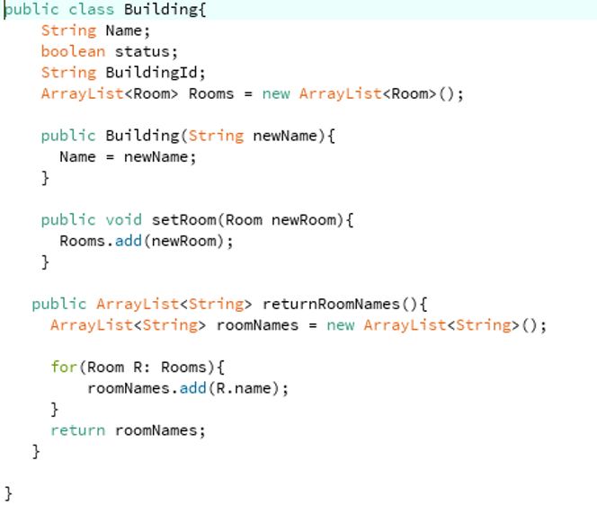
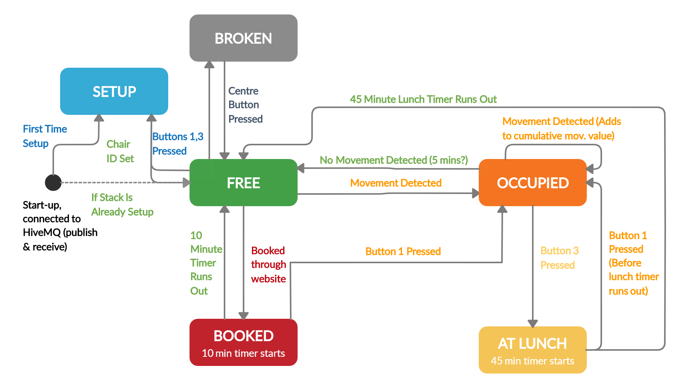

# System Design

#### Contents

- [User Stories](#userStories)
- [The 3 Subsystems](#theSubsystems)
- [The Evolution of Wireframes](#evolutionWireframes)
- [Communication Protocols](#communicationProtocols)
- [Data Persistence](#dataPersistence)
- [Web Technologies](#webTechnologies)

FindADesk has a system design composed of 3 different subsystems, intended for 3 different user cases. These are a desktop application, a web application and an IoT device application (M5Stack). It centers around ‘chair’ objects, with the 3 different sub-systems all interacting with ‘chair’ objects in different ways. Information is communicated between the systems regarding the number and location of chairs, the state that any chairs are currently in and if there is a booking made for the chair. This allows students to see exactly where any chairs are and whether they are available. The communication is carried out by sending JSON objects through MQTT, a lightweight messaging protocol, with the message sending automated by each of the sub-systems.

  

  <i>Figure 1. Overview of System Architecture</i>

## User Stories

Students and administrators need a straightforward, easy to use User Interface (UI) for each of the subsystems which visually represent our products concept and functionality. We designed our system to comply with this, but also focussed on meeting the requirements of all the different user stories for our product.

The first of our three sub-systems is the desktop application that administrators can use to design rooms, add tables and chairs, and view maintenance reports. Some examples of user stories for this are:

- _An administrator wants to create new study spaces at their university and display this information to students, so they open the desktop application and add a new study space. This includes creating rooms, desks, chairs and buildings and being able to manage the IDs of these separate entities._

- _An administrator wants to be able to find the locations of chairs that are faulty in order to schedule maintenance._

- _An administrator wants to be able to monitor usage in each of the different study spaces._

The second subsystem is the web application that students use to view the learning spaces, the available chairs in each and to make a booking for a chair. Some user stories are:

- _A student who is new to a university wants to see a list of all the available buildings and rooms where they can study._

- _A student who wants to go into university to study is not sure they will find a study space to work. They want to check if there are free seats available._

- _A student is not sure whether seats will still be available by the time they get into the university. They want to be able to make a booking to guarantee a space for when they arrive._

- _A student struggles to study when rooms are very busy and noisy. They want to be able to easily check which study spaces are the quietest at the university._

The final component of our product is the M5Stack which is attached to the back of every chair and displays the chairs current state. Some examples of user stories for this are:

- _A student working at a desk wants to be able to leave the desk for breaks/lunch without the worry of having their desk taken by another student in their absence._

- _A student looking around a library for a seat sees a desk with a bag near it, but nobody is sitting in the chair, so they aren’t sure if the chair is still in use._

- _An administrator wants to be able to easily setup chairs in study spaces so that the FindADesk web application can be used._

- _A librarian walking around the library notices that a chair is broken. They think it would be useful to have a system of reporting these broken chairs._

## The 3 Subsystems

#### Desktop Application

The chair object is initially generated by the desktop application – this is the subsystem used by an institution administrator to implement the visual representation of their university’s study spaces. This is achieved through the creation of building, room and desk objects which can be added or removed to reflect the volume and rough visual layout of desks on a room by room basis. Once a room and its desks have been added, the associated data of the room (its parent building id and name, its own name and id as well as the number of tables it contains) is published to the web application via a JSON string. The processing application also receives MQTT messages from the chair if it sets a status that requires action by the administrator (this is primarily if it is broken). This report is generated and is visible by the administrator so that they can take appropriate action.

  

  <i>Figure 2. "Building" class in the desktop application. This represents how data is stored and parsed. Other classes are similarly structured.</i>

The Processing application is built around a cascade of objects representing buildings, rooms, desks and chairs. These each contain an Array of objects such that buildings contain rooms which contain desks which have chairs.

The building and room classes have both name and ID attributes (see figure 2), while each subsequent sub-object also stores the ID of its parents such that a desk, for example, will also have attributes denoting the IDs of the room and building to which it belongs. This allows the processing app to easily send chair information to the web app and subsequently receive chair information from the stack. We did not see much value in using inheritance in the application, primarily because the objects function as data structures with little extra functionality gained from using it. In effect, the desktop application uses Object Oriented design to closely mirror the real world layout of a library / study space, and to also act as data storage containers for easy communication between applications.

  

  <i>Figure 3. "Building" class in the desktop application. This represents how data is stored and parsed. Other classes are similarly structured.</i>

The desktop application also contains classes representing the main dashboard and one which updates the view based on the user’s interaction. The view class updates the dashboard and also handles the user interactions with the application, including adding rooms and desks. The main dashboard class sets up the dashboard, draws the tables and handles the parsing and publishing of MQTT messages.

#### Web Application

The web application, built using HTML, CSS and Node.js, is designed for students who wish to see the current states of the rooms. It shows an overview of all the different chair objects, showing which buildings and rooms they are contained in and its current state. It is run using an express server, so it can continuously be checking for messages from the other devices. It subscribes to the desktop application through MQTT so that the website can be updated with the correct number of rooms in each building and the correct number of tables within each room. It is assumed for this prototype that there are four chairs per table and this is calculated on the web application when displaying the number of chairs in each room.

  

  <i>Figure 3. Students can book a chair by clicking on one that is free.</i>

The information is saved in a NoSQL database (MongoDB) so that information can be reloaded (rather than the desktop application continuously sending messages regarding the current room states).

The web application also subscribes to the M5Stack so that it can update the web page with the current state of the different chair objects (occupied, free, booked or at lunch). Using this information, students are able to see the current occupancy of each room and to make a choice about where they would like to study.

Further to this, a student is able to select a chair and make a booking. This will subsequently publish a message to the M5Stack for that particular chair object, reserving it for that user. When the chair becomes free again the M5Stack will send a message back to the web application, informing it that it is now free.

#### M5Stack Application

The M5Stack subsystem is responsible for detecting the current state of the chair and displaying it, which is determined by following the above state machine diagram. When the stack initialises for the first time, it enters the 'setup' state:

_Setting the IDs within the 'Setup' state_

Here the user can enter the relevant building, room and chair IDs on to the stack directly using the buttons.

Once setup is complete the stack enters the ‘free’ state, then stays in free until one of the stated conditions is met:

It can only then move between the states which are connected by the arrows shown above (e.g. it cannot move from ‘booked’ to ‘at lunch’ directly). The stacks onboard accelerometer is used to measure vibration from the chair, and if it is above a certain threshold the state then moves to ‘occupied’:

While in use, the leftmost button can be used to start the chair user’s lunch break, initialising a 45-minute timer in which the chair is reserved and cannot leave this state. To exit this state, either the user must scan their U-Card, returning the chair to the ‘occupied’ state, or the timer can run out, returning to the ‘free’ state (because evidently the user hasn’t made it back in time from lunch, so their seat is now available).

From ‘free’, the chair can also change to the ‘booked’ state, which means that a user has reserved that seat through the website application. This initialises a 10-minute timer, allowing the user to get to the seat and scan their U-Card, changing the state of the chair to ‘occupied’:

If they fail to scan their U-Card within 10 minutes, the chair state reverts to ‘free’. A fifth administrator state was added to the state machine, allowing the chair to be declared ‘broken’ if an administrator U-Card is scanned and the leftmost button is pressed. Changing to this state then notifies the processing application that a chair is broken so it can be repaired – the only way out of this state is for an admin to once again scan their U-Card and press a button, thereby preventing the chair from being used when it is broken.

When the stack changes between two states, it publishes its new state to the MQTT WebSocket (which the web client receives and updates on the website and within the database). This can be seen in the diagram above; where a condition is met, the state is changed and published to MQTT, and then the stack loops through its new state until another condition is met and the state changes again.

The stack can also receive information from the website and send information to the processing application. Both of these are compartmentalised and it is only able to receive the ‘booked’ command from the website when it is in ‘free’ mode (as dictated by the state machine), and it will only send out information to the processing application when it enters the ‘broken’ state (this is also achieved through the use of MQTT).

In terms of Object-Oriented design, the code for the stack itself is written in C++ in a functional way, but in terms of the entire system the stack in itself is very much a Stack object, which has an id and a state which can be passed around and stored by the processing and web applications.

  

  <i>Figure .... Booking sequence diagram</i>

## Evolution of Wireframes

[View all wireframes](images/Wireframes)

On the desktop application we first experimented with having a search bar to find buildings. This proved to be both difficult to implement and difficult to use for the user. Based on user feedback, we decided instead to use dropdown lists for users to navigate through buildings and rooms. We tried to do this by adapting the code from the processing code walkthrough, however quickly found out that it only partially fulfilled what we wanted to get done. By using controlP5 and by creating functions with the same names as the controlP5 controllers we were creating (similar to how you write code in CSS/javascript) we were able to extract which items were being clicked in the drop down lists and from that we could start to navigate between classrooms and display them individually.

The fundamental design of the desktop UI revolves around showing the user a graphical representation of the desks and chairs on a room by room basis. Available chairs are shown in green while red chairs signal any other status. Clicking on a drop-down menu and selecting a building and room allows users to add a new desk to the room one at a time. The user can also choose to add a new room to the selected building. Users understood the UI intuitively and needed little help navigating it. One user however did comment that when creating a new room, the program should automatically navigate to the new room instead of it having to be selected post-creation. This happened after the user accidentally added more desks to the current room instead of the new one.

The initial user interface designs for the M5Stack were basic, simply indicating the current state with text and a unique colour so that the user could see the state of the chair from a distance. The ‘lunch’ and ‘booked’ states also had timers counting down to indicate the time left in that state – both reverted back to free if the timers expired without any user input. The lunch and booked states were originally designed for the user to be able to scan their U-Card to access that chair, but as an initial temporary measure the user simply had to press the left-most button to access the chair.

Later versions of the UI include a chair id which allows administrators to know the chairs intended location within a room (by checking against the web/processing app). A prompt on the ‘in use’ screen also tells the user that they can start their lunch break by pressing the leftmost button. Implementing an RFID scanner was attempted to add the ability to scan a U-Card so it could be accessed from the ‘lunch’ and ‘booked’ states, however this proved exceptionally difficult. As a more suitable temporary measure, a unique combination of button presses is required to access these states.

As a later design change, we also added in the fifth state of ‘broken’, which allows an administrator to scan their U-Card, press a button and report the chair as broken to the processing application (so administrators can arrange for it to be repaired).

Finally, so that the stacks could be more ‘plug and play’ and the ID isn’t hard-coded, we created a sixth ‘setup’ mode into which the stack initialises, allowing an administrator to set the 8-digit chair ID. This screen will only show on first use, so every other time the stack starts it will go straight to the ‘free’ state. It can however be accessed at a later date to modify the chair ID by pressing buttons 1 and 3 simultaneously – this allows chairs to be moved around buildings and reprogrammed easily.

For the web application UI wireframes we started with a basic paper prototype, we tested this on volunteers to try and get some early feedback.

Some of the key points included:

- _What is the purpose of the application. What are users supposed to get out of it?_

- _Oftentimes users had to be guided towards the next page - the flow wasn’t natural to them._

- _Colour of chairs not explained (e.g. green = free, red = occupied). A colour key would be beneficial._

Based on this feedback, changes were made to the wireframes before beginning implementation of the website.

The UI layout was reassessed with each subsequent iteration/sprint and the design was changed based on the user feedback. Some of the comments recorded over subsequent sprints are:

- _Wasn’t clear how many free chairs in a room. Did the number on room overview page refer to total chairs or total free chairs?_

- _Not clear about booking time. For example, how long do I have to get there?_

- _How to identify what chair I have booked? Is there an ID/code?_

Changes to the UI were continuously updated based on these feedback comments throughout the iterations.

_Changes in the UI design of one of the web pages over time_

## Communication Protocols

MQTT, a lightweight messaging protocol, was used for communication between the different applications. The MQTT transfers information as text and therefore some sort of text structure is required to make the communication simpler and more efficient. It was decided that a JSON type text structure would be able to send information in the most efficient way, allowing for easier parsing when receiving a message.

Our system required that there be multiple communications going in different directions between the different devices. Because of the complicated communication design of our system, we decided to use multiple different subscriptions so that it was clear which messages were being published to which application. These are:

#### FindADesk_ProcessingToWeb

The desktop application needs to publish information to the web application regarding the current state of the university study spaces, including the number of buildings, the building names, number of rooms in each building, room names and the number of tables and chairs in each room. This is sent as an array of ‘room’ objects.

#### FindADesk_WebToProcessing

Likewise, the desktop application is able to make a request to the server to get all the information regarding the buildings, rooms and chairs that the web application has saved in the database.

#### FindADesk_StackToWeb

The M5Stack publishes to the web application, sending information about the current state of the chair it is on (whether this be “free”, “lunch”, “occupied” or “booked”).

#### FindADesk_WebToStack

The web application also needs to publish information to the M5Stack, informing it if a student has made a booking.

#### FindADesk_StackToProcessing

Finally, the M5Stack publishes information to the desktop application regarding any faulty chairs that the admin team will want to respond to.

## Data Persistence

In the early system design stages we considered and designed a relational database (figure .. ), however we quickly dropped this when we decided that we wouldn't be using user accounts in the design of our prototype.

When we started out creating our minimum viable product, we tried using the browser’s local storage to store the data. However this would rely on the other sub-systems continuously sending out messages to ensure the web pages were concurrent with the current state of the rooms and chairs. Furthermore, the user would have to be on the website whilst a message was received from the desktop application or the stack which would result in missed data if the page crashed or was closed. Also, if a user was to delete their local storage then they would again lose all the information and could potentially try to make a booking on a chair that was already occupied by someone else.

Following this we considered designing a new SQL database due to some of the entities having relational features (e.g. each building contains many rooms and each room contains many chairs). However, as we were investigating this avenue, we realised that NoSQL had the advantage of allowing us to reuse the same JSON structures that we were already using to communicate through MQTT, removing the need to design a relational database. Therefore, we decided to use MongoDB as it is well supported with node.js and express.

The database schemas were designed as below, with the room objects containing an array of chair objects. The ‘freeChairs’ attribute is calculated based on the number of chairs currently in the ‘free’ state. As mentioned previously, the ‘chair’ attribute is calculated by multiplying the number of tables by four (it is assumed there will be 4 chairs per table for this prototype).

|         roomSchema          |         chairSchema         |
| :-------------------------: | :-------------------------: |
|  |  |

Another database schema could entail having 3 different objects; a building object, room object and chair object with each building containing an array of room objects and each room object containing an array of chair objects. It then may be better to implement our data persistence using a relational SQL database and it would likely scale better than having lots of nested arrays of objects in NoSQL documents, particularly if we then decided to add in user accounts and attach bookings to said accounts later in development. This would also allow the data to be better normalised, as the building names would not have to be repeated with each new room. However for our purposes and the relatively low number of buildings that there would likely be, it was much simpler to implement a NoSQL database because of the similarity in data structure between the information sent by the JSON strings through MQTT and a Document Database such as MongoDB. 

## Web Technologies

In order to build on our original wireframes and get a minimal viable product working, we originally built a simple static website with HTML CSS and JavaScript (as mentioned before using the browser local storage for data persistence). As our application developed over subsequent sprints, we realised that we would need a server and back-end to process the communication protocols and data-persistence mechanisms.

As we wanted to build a fast-scalable application which wouldn’t need to be CPU intensive, we decided to use Node JS as it also provides a lot of features and doesn’t involve using another language for the backend. We also used the framework Express as it provides a lot of tools to quickly and easily build a server-side application with minimal hassle.

As our website would require dynamic HTML population with information received from the M5 stack and processing, it was decided that a templating language would be needed. We chose EJS as it would allow for easily creating HTML elements with plain JavaScript.
