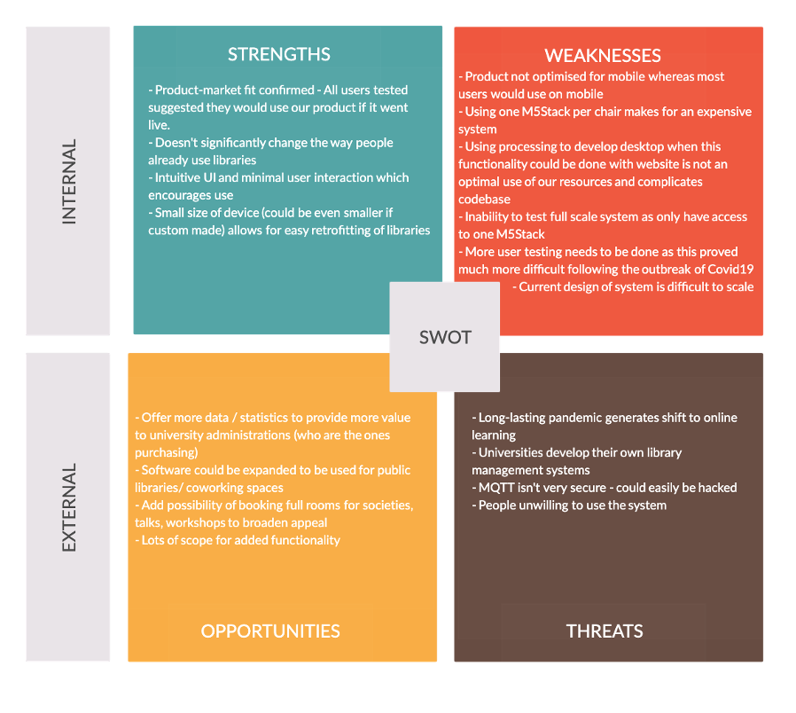

# System Implementation

#### Contents

- [Breakdown of the Sprints](#sprintBreakdown)
- [Evaluation Techniques](#evaluationTechniques)
- [Social and Ethical Implications](#ethicalImplications)

Throughout the project we strived to adhere to AGILE working principles such as:

- ‘Deliver working software frequently (weeks rather than months)’: The project was broken up into clearly defined sprints with each sprint outlining specific design/implementation goals. We tried to ensure that after the initial sprint, we had a working ‘minimum viable product’ with basic functionality that could be demonstrated. Successive sprints would build on our product iteratively.
- ‘Welcome changing requirements, even in late development.’: Where the evaluation of a sprint highlighted specific issues with our design choices, these issues were used to direct the goals of the subsequent sprint.

## Breakdown of the Sprints

#### Sprint 1

Sprint one involved group brainstorming, designing basic UI, and converting paper prototypes to tangible software. The overall objective for the first sprint was to implement a basic working version of each subsystem which could then be developed in later sprints.

###### Goals:

- To solve the overarching user story of both students’ and administrators’ need for a straightforward, easy to use UI for each of the subsystems which visually represent the product’s concept and functionality.

- Agreeing on design of basic UI based on user feedback from paper prototypes

- Using feedback gathered through Wizard of Oz techniques to determine basic building blocks for each subsystem from which to build out the rest of the program

- Decide on the initial stack functionality and placement - we were unsure at this stage exactly how the M5Stack would be incorporated into the system design.

Sprint one was heavily design oriented, using user feedback gathered through Wizard of Oz techniques on the initial paper prototype to determine the basic building blocks for each subsystem from which to build out the rest of the program. At this stage, little functionality was implemented other than to mirror the basic visual layout of the wireframes, with the goal of gathering further UI-related user feedback in a software context. This involved designing static HTML and CSS pages for the website and for the stack to display single words such as “booked” or “occupied” to indicate chair status. For the desktop application this involved developing the basic dropdown menus for navigation through buildings and rooms, as well as graphic representation of the tables and chairs within each room.

To evaluate the work of this sprint we had a group meeting where each subsystem was reviewed as a team. We also asked for some volunteers to run through the web application to test whether our UI made sense to those who were unfamiliar with the design. We came to the decision that placing the M5Stack on the chair and using the accelerometer to check if a chair was occupied (as opposed to users pressing a button) would remove the problem of users forgetting to check in themselves. This decision was facilitated by user feedback.

#### Sprint 2

We agreed the next most important feature to implement was communication between the 3 different subsystems, allowing us to have a functioning minimal viable product - this became a focus of sprint 2. We also aimed to improve on user experience based on the key feedback points obtained from the first sprint.

###### Goals

- Following the ‘substitution’ principle, deciding to establish a common contract between all modules via the MQTT protocol.

- Agreeing on the MQTT subscriptions for each subsystem and the structure and content of data sent via MQTT.

- Minor bug fixing and optimization of work completed in sprint 1.

- Deciding on which additional functionality was feasible and worthwhile given the aim of completing a functional prototype.

- Following the ‘Open/closed’ principle we implemented a ‘state machine’ to define each state of the stack. This would allow us to implement additional states in the future whilst ensuring the fundamental state mechanism.

For the website, setting up a communication with the MQTT broker involved linking the HTML pages with JavaScript files. This allowed for connecting and subscribing to the correct topic, as well as applying functions to connect DOM elements to the publishing of messages to the MQTT. At this stage a single ‘chair’ HTML element was chosen to act as the button which, when clicked, sent a simple text message with the word ‘booked’. The JavaScript would simply console log any messages received from the other subsystems.

For the desktop application, the creation of classes and objects representing chairs, desks, rooms and buildings became necessary in order to ensure that data persisted between what was visually represented for the administrator and what was sent to the website. Initially, the JSON string sent to the website contained far more information than was needed, and our initial method required chairs being sent to the website one at a time, requiring far longer and more complex JSON objects to be built and parsed. Instead, the group agreed on a strategy to build the IDs so that information could be sent on a per room basis. This meant we had to simplify some initial design choices – for example we had hoped to have desks of variable size demonstrable in the prototype, but the additional complexity balanced against the relative gain forced us to abandon this feature.

It became apparent that having communications going in multiple directions and with different messages would be difficult to process (as it was not clear which messages were for meant for which subsystem). We decided that we would need multiple MQTT topics that the subsystems can subscribe and publish to. To help prioritise our backlog and add features which best fit our user stories, we assigned one of our team members as the ‘Product Owner’ for future sprints, taking the role of an exemplary customer and focusing design decisions to add the most value.

#### Sprint 3

The priorities in this sprint were to implement a data persistence mechanism to store data and to finalise the format of the JSON messages being sent between the different subsystems using MQTT. Also, we aimed to implement more functionality based on the requirements of the system and needs of the user.

###### Goals

- Agree on the different subscription names we would need for all the different MQTT messaging directions.

- Implement functions in the web application allowing for dynamic HTML page loading of buildings, rooms and number of chairs based on the received messages from the desktop application.

- Implement some basic data persistence on the web application, using local storage in the browser.

- Refactor M5Stack code so that the chair stays in the ‘occupied’ state even when it doesn’t detect movement for a few seconds (based on user feedback).

- Add an RFID scanner to the M5Stack so that users can scan their U-Card and authenticate their chair booking.

- Implement an add/remove room and desk feature to desktop app, finalizing basic desktop functionality.

Following discussions with the product owner member of the team, the UI wireframes were redesigned for each of the subsystems. Some of the key points from previous user feedback were that the colour key for the chairs on the website was not obvious and that users were not sure how they would recognise their chair when they would get to the study space.

The JavaScript on the web application was extended to parse JSON strings sent from the desktop through the MQTT. It then saved the information from the JSON string in an array of JSON objects which were subsequently saved in the local storage of the browser. The JavaScript file was linked with all the HTML pages so that the MQTT messages could be received and processed regardless of the current page. The formal JSON object to be sent from the web app to the M5Stack was also finalised and the code implemented to publish it as a string through the MQTT.

The processing app was extended so that the administrator was able to add rooms and desks. A textbox was implemented so that the user was able to name the room before adding it. This was not necessary for the desk – an automatically generated id (8th table = table id 8) was sufficient. This was in response to the user story that the administrator will want to create new study spaces at their university and display this information to students.

Unfortunately, we were unable to interface the RFID scanner with the M5Stack - this may have been due to the fact that eBay bought MFRC522’s can often be faulty. As a result of this, one of the goals for Sprint 4 will be to design a suitable alternative so that users can access the chair after booking it.

When we evaluated our product at the end of sprint 3 it became obvious that the architecture of the web application would have to be redesigned. This was largely because using local storage as the data persistence mechanism came with many flaws (please see data persistence section above). It was decided that a server-based web application would improve the functionality of the website whilst allowing for more advanced data persistence mechanisms (such as an actual database).

#### Sprint 4

The main focus of sprint 4 was to convert the web application to use a server and to change the data persistence mechanism. We also wanted to add further functionality to the M5Stack and desktop applications by implementing a ‘faulty chair’ feature.

###### Goals

- Implement a Node.js web server.

- Change our approach to data persistence and implement the NoSQL database MongoDB.

- Add ‘broken’ and ‘setup’ states to the M5Stack to allow the chair id to be set and to allow the chair to be reported faulty

Express was used as the framework for implementing the web application server. We connected the web application to a local MongoDB database using the JavaScript library Mongoose. EJS was also integrated to help create dynamic web pages based on the data stored in the database) The UI design was updated on the web application based on the feedback from the last sprint (a hover effects on chairs to display the current state and the chair ID given to the user as an identifier of their chair).

The ‘broken’ state (as shown in the M5Stack State Diagram) was added, after consulting the Product Owner, to fulfill the user story which focuses on the librarian wanting a convenient system to report broken chairs. The ‘setup’ state was also added to allow administrators (e.g. the university/library workers) to easily set each chair up with an ID that corresponds to its allocated ID in the database. A ‘faulty chair’ report was added to the desktop and communication between the stack and desktop was finalised.

## Evaluation Techniques

Throughout our project we used the following methods to evaluate our designs:

- Wizard of Oz

- User testing (with think aloud and interview)

- Assigning product owner

- SWOT analysis

The very first evaluation technique that we used was “Wizard of Oz” which was used at the paper prototype phase. This combined with think aloud evaluation provided quick and cheap feedback to rapidly iterate our initial designs. The next iteration of paper prototypes was digitised with Processing allowing us to expand on this and give the users a better sense of the UI. These initial evaluations worked quite well, and because these tests were conducted during unit workshops we were able to gather a variety of participants.

We repeated these processes when fleshing out the three key subsystems, continuing to use Wizard of Oz and think aloud with the paper wireframes, paint mockups, and finally the basic desktop app. These proved useful, however in hindsight we probably should have tried to draw from a wider pool of participants as we reused the same three test subjects for this testing, which meant the feedback received lacked breadth and exposed our feedback to potential individual biases as they began to envision what they thought the product should look like.

The lockdown in mid-March complicated user testing. Without access to a wide pool of potential subjects or indeed the ability to fully demonstrate each subsystem, we were forced to base the rest of our development on our early testing. At this stage we had considered using storyboarding as well which could have been drawn up at home. However, as the user journeys for the MVP were relatively short everyone involved in the project agreed on the general direction that it should take, we felt that this was unnecessary.

Considering the difficulties of conducting user research, we decided to assign a product owner to be responsible for the evaluation of the design and the prioritisation of the feature backlog. He was able to test the website and desktop application on his flatmate, however this was of limited benefit; his flatmate wasn’t a student. As we worked towards completing a Minimum Viable Product, the feedback received didn’t warrant any major design changes, focusing more on minor usability issues such as clearer colours, and numbers, ids, and buttons not being fully clear on the website and processing app. Assigning a product owner had both the advantage and disadvantage of centralising decision-making. This allowed for a clearer direction which ended up focusing on delivering core functionality versus over-developing certain features in the key-subsystems. This however raises concerns over whether individual bias towards the product owner’s vision for the product could drive design decisions.

Finally, when evaluating where we have arrived as of writing this report, we decided to conduct a SWOT analysis to identify the strengths and weaknesses of the current product to understand where to make improvements for future work. Ideally, we would have done this after a final large round of user testing, however for obvious reasons this was not possible, and may have limited the scope of our insight.

  <i>Figure 1. SWOT analysis</i>

## Social and Ethical Implications

In terms of the ethics of our project, we made sure to follow the ethical guidelines set out by the university. Participants in each user-feedback study gave verbal consent, and were both briefed and debriefed as to the purpose of each study they were involved in. In terms of the data we are currently storing, all of it is related to participants’ opinions regarding the layout and design of our user interfaces, with no personal data collected. We are not aware of any way in which our user testing could cause harm, and we made sure to give participants the ability to withdraw their responses.

The main ethical issue to consider when the system is fully implemented is the data being collected on the individuals using the chairs. For users that don’t use their account to book chairs or take lunch breaks, no personally identifying information is collected, only chair usage by anonymous users. We don’t believe this constitutes a breach in privacy, however when users sign in on the website, then book a chair and continue to use it for the next few hours, the exact location of that student is being stored by the university. For this reason, when signing in on the web application for the first time, users will be required to consent to the university storing this information, and if they choose not to consent they are still free to sit in chairs and use libraries as they would have done before. No new personally identifying information (other than that already stored by the university) will be required by the user when they sign in, however in the future our system will be storing analytics on each user which will have to be encrypted and stored securely.

Socially there are some potential implications that can be considered. This product aims to improve student’s ability to find study spaces, but it also has the potential to hinder students who are less willing to interact with, or those who are not aware of, the product. To try to avoid this situation, desks can only be booked for a limited amount of time (10 mins) before they revert to ‘free’ again. Also, students who don’t interact with the stack or use the website to reserve seats can still interact with libraries in the same way they always have by physically finding a seat and sitting in it (as long as it is ‘free’). Therefore, we do not believe the introduction of this product will pose a problem in terms of disrupting the current social norm when finding study spaces.

Another social consequence to consider is the conflict that might arise when students sit in seats that have already been booked. It might be difficult to enforce the rules of the FindADesk system, possibly requiring a team of administrators in each study space to resolve any disagreements. However, this issue is not too disimilar to normal student study space conflicts (e.g. moving someone’s things off a desk whilst they have gone to lunch) and therefore we don’t believe that the FindADesk system introduces a new problem. Research could also be done into the best way to solve this, such as an alarm or vibration setting when a chair is sat in while in its ‘booked’ state, allowing FindADesk to actually become part of the solution.
